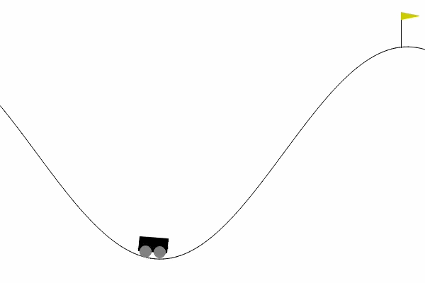

<p align="center">
  
</p>

# Mountain Car

Comparative study of reinforcement learning algorithms on the MountainCar problem using [Gymnasium](https://gymnasium.farama.org/). We implement and compare three agents — tabular Q-Learning, Deep Q-Network (DQN), and Soft Actor-Critic (SAC) — across four reward variants of the environment.

The goal is to train a car to reach the top of a hill by building momentum through back-and-forth swinging, since the engine alone is not powerful enough to drive straight up. Each algorithm approaches the problem differently: Q-Learning discretizes the state space into a lookup table, DQN approximates Q-values with a neural network, and SAC learns a stochastic continuous policy with entropy regularization.

All agents are evaluated on the **true objective** (steps or fuel to reach the goal), kept separate from any shaped reward used during training. This ensures fair comparison regardless of reward engineering choices.

## Variants

| Variant | Environment | Reward | True Objective |
| --- | --- | --- | --- |
| `discrete_steps` | `MountainCar-v0` | −1/step | steps to goal |
| `discrete_fuel` | `MountainCar-v0` | 0 no-op, −1 left/right | non-null actions |
| `continuous_steps` | `MountainCarContinuous-v0` | −1 − 0.1·\|a\| per step, +100 on goal | steps to goal |
| `continuous_fuel` | `MountainCarContinuous-v0` | −0.1·a² per step, +100 on goal | ∫ a² |

## Structure

- **envs/** — Reward wrappers (`DiscreteFuelRewardWrapper`, `ContinuousStepsRewardWrapper`), reward shaping (`EnergyShapingWrapper`, `BestPositionWrapper`, `GoalBonusWrapper`), objective tracking (`TrueObjectiveWrapper`), and `make_env()` factory
- **agents/** — `QLearningAgent` (tabular, 40×40 bins), `DQNAgent` (PyTorch, replay buffer + target network), `SACAgent` (SB3 wrapper). All subclass `BaseAgent`
- **core/** — `trainer.run()` step loop, `evaluator.evaluate()` (reads `info["true_obj*"]`), `logger.py` (TensorBoard + CSV + runs.json)
- **visualization/** — `plots.py`: reward/objective curves, policy map, value map, action heatmap, entropy heatmap, phase portrait, success rate curve, Q convergence
- **notebooks/** — `main.ipynb`: trains and evaluates all agents, generates all plots
- **runs/** — Auto-generated TensorBoard event files and CSV logs per training run
- **saves/** — Agent checkpoints saved after training (`.npz` for QL, `.pt` for DQN, `.zip` for SAC)

## Usage

```bash
pip install -r requirements.txt
```

Open `notebooks/main.ipynb` and run all cells. Monitor training live:

```bash
tensorboard --logdir=runs/
```
